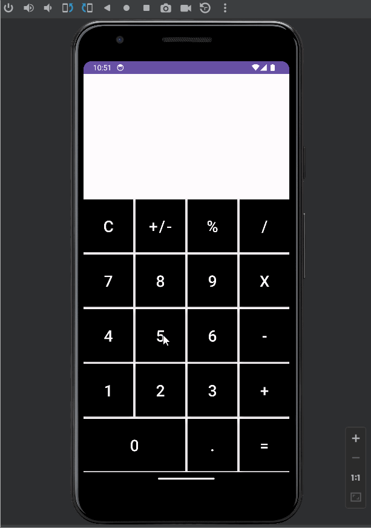

# Calculator Project

This is a calcultor made in Android Studio with Kotlin. You type in digits then click what operation you would like with them, and the calculation should be completed.

## Functionality 

The following **required** functionality is completed:

* [ ] User sees an interface with numbers 0-9, and different operations.
* [ ] User can click on each button to display what was clicked on the screen.
* [ ] User can clear the screen with the C operation.
* [ ] User can click the equals operation to complete the calculations.

The following **extensions** are implemented:

* User can rotate device and get a rotated interface with 4 new buttons.
* User can use + operation to add, - operation to subtract, X operation to multiply, and / operation to divide.

## Video Walkthrough

Here's a walkthrough of implemented user stories:

GIF created with [LiceCap](http://www.cockos.com/licecap/).

## Notes

In my last version, I was not able to get the calculator to preform correct operations, as the math was incorrect in the functions, but I have corrected that. All operations are now possible.

## License

    Copyright [2023] [Tristan Dearborn]

    Licensed under the Apache License, Version 2.0 (the "License");
    you may not use this file except in compliance with the License.
    You may obtain a copy of the License at

        http://www.apache.org/licenses/LICENSE-2.0

    Unless required by applicable law or agreed to in writing, software
    distributed under the License is distributed on an "AS IS" BASIS,
    WITHOUT WARRANTIES OR CONDITIONS OF ANY KIND, either express or implied.
    See the License for the specific language governing permissions and
    limitations under the License.
